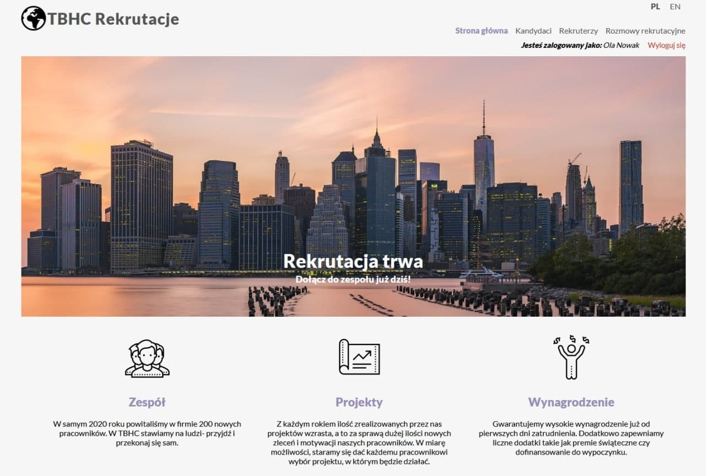
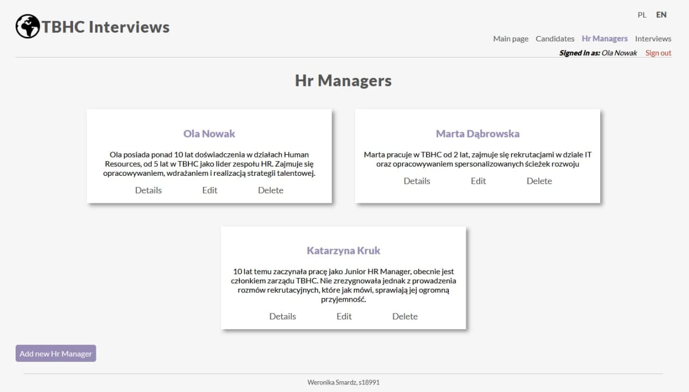
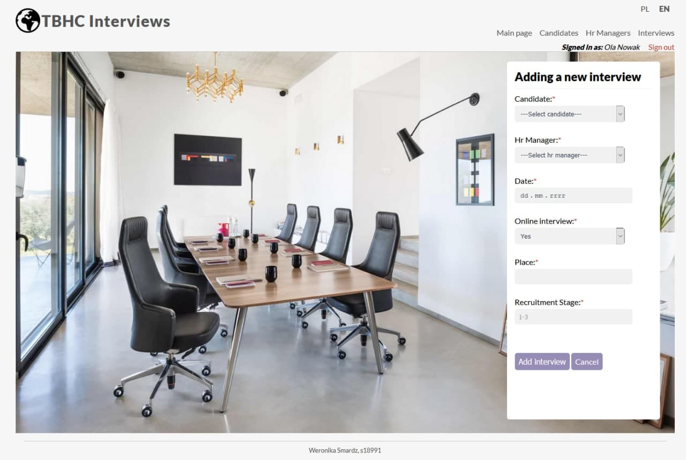
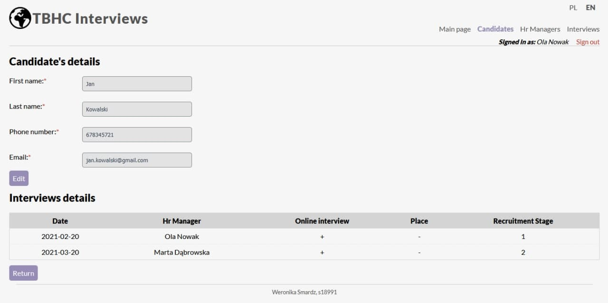

# Recruitment_Management_App

Simple application created to manage interviews created with Node.js and MySQL.
Available languages: Polish, English 

### Technologies
* Node.js, Express.js, Sequelize ORM
* JavaScript- Client Side Validation
* Docker
* MySQL database
* HTML, CSS- structure and views
 
### Views
##### Home page

List view

New interview form 

New candidate form

Details page

